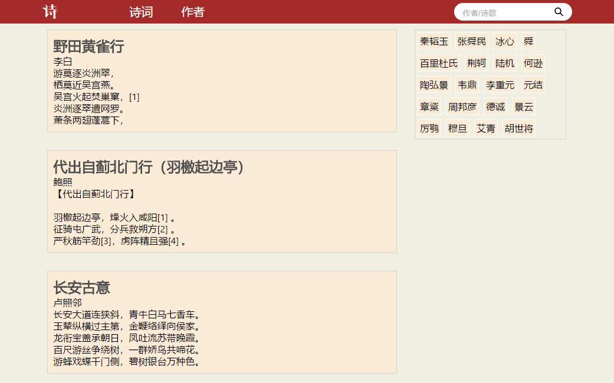
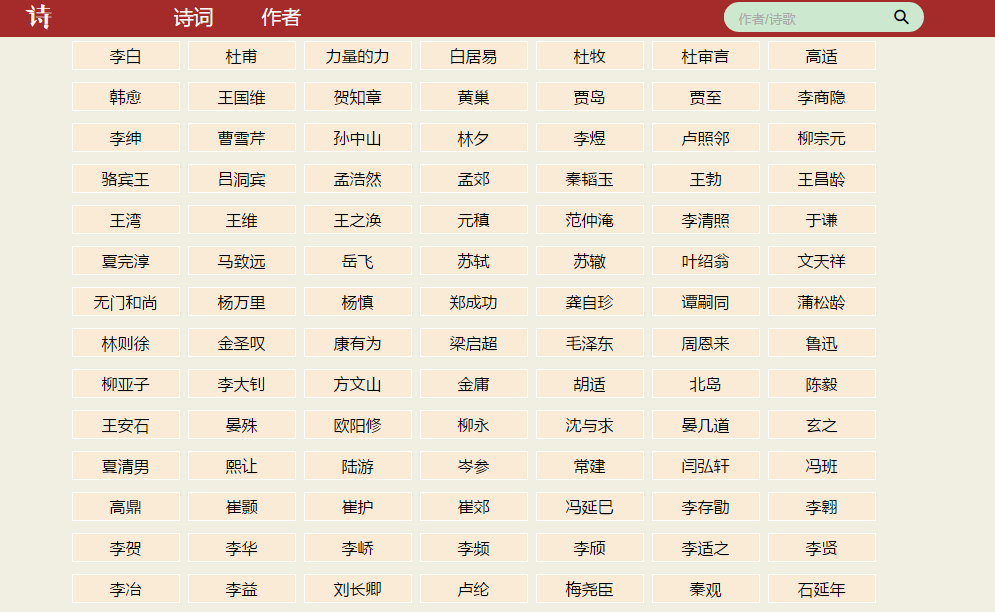
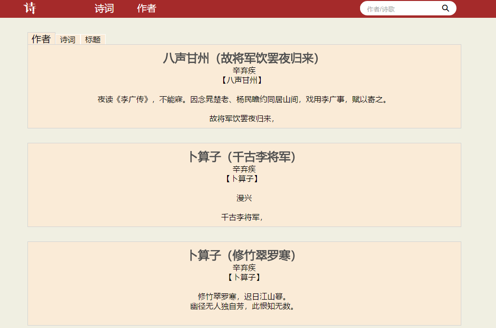

# 诗词网站demo

## 目的

* 练习 vue 和 webpack。

* 实现自己的一个小愿望——写一个诗词网站。

## 前端

* vue + axios + webpack

## 后端

* php + mysql

## 兼容

* 移动端

* pc（ie9+）

## 预览

## 链接

&emsp;&emsp;链接：[诗词demo](http://坚.top/apps/poem)